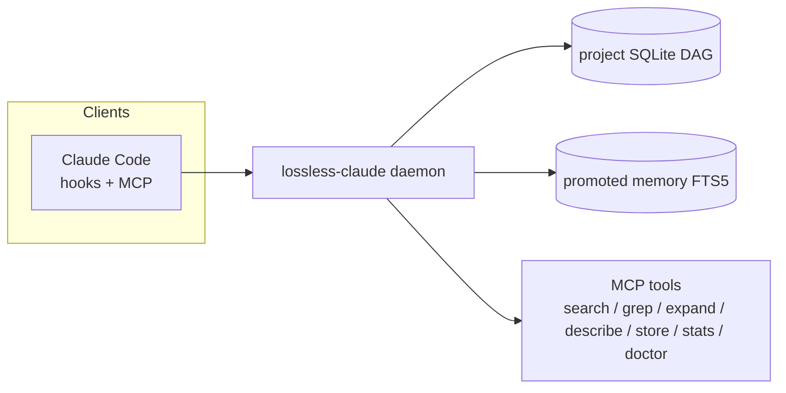
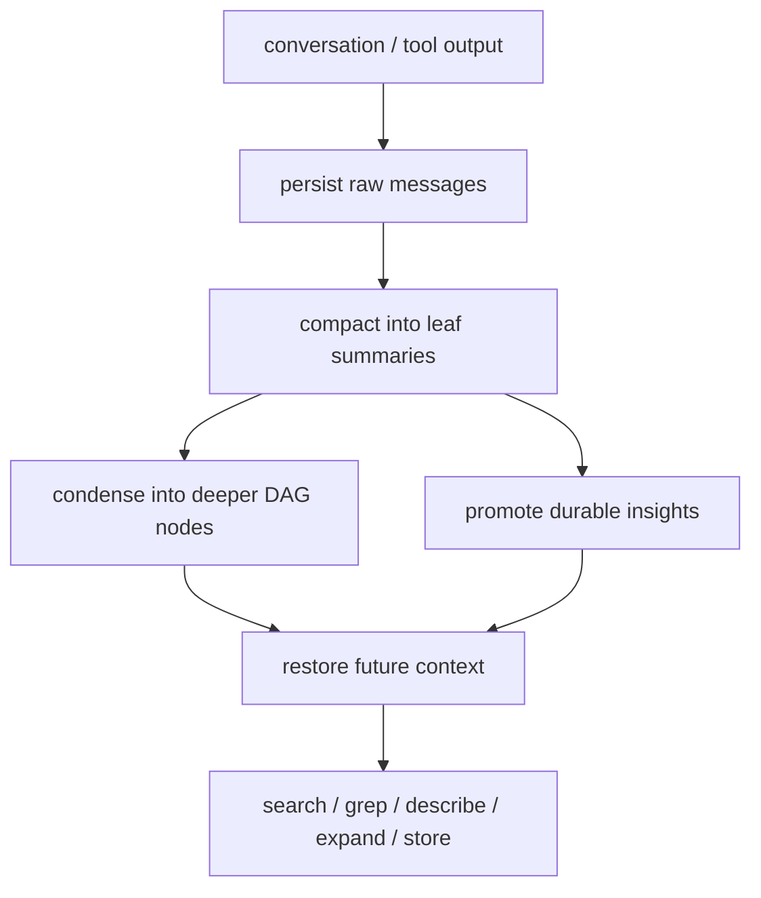
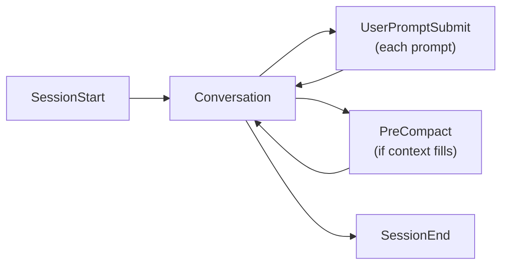

<p align="center">
  <strong>lossless-claude</strong><br>
  Shared memory infrastructure for Claude Code
</p>

<p align="center">
  DAG-based summarization, SQLite-backed message persistence, promoted long-term memory, MCP retrieval tools
</p>

<p align="center">
  <a href="https://www.npmjs.com/package/@lossless-claude/lcm"></a>
  <a href="LICENSE"></a>
  <a href="package.json"></a>
  <a href="https://github.com/anthropics/claude-code"></a>
</p>

<p align="center">
  <a href="https://lossless-claude.com">Website</a> &bull;
  <a href="#runtime-model">Runtime Model</a> &bull;
  <a href="#installation">Installation</a> &bull;
  <a href="#mcp-tools">MCP Tools</a> &bull;
  <a href="#development">Development</a>
</p>

---

`lossless-claude` replaces sliding-window forgetfulness with a persistent memory runtime for both humans and agents.

- Every message is stored in a project SQLite database.
- Older context is compacted into a DAG of summaries instead of being dropped.
- Durable decisions and findings are promoted into cross-session memory.
- Claude Code reads and writes project memory across sessions.

Humans and agents use the same backend. The integration surface differs by client, but the memory model is shared.

This repo started as a fork of [lossless-claw](https://github.com/Martian-Engineering/lossless-claude) by [Martian Engineering](https://martian.engineering), adapted for Claude Code. The LCM model and DAG architecture originate from the [Voltropy paper](https://papers.voltropy.com/LCM).

## Runtime Model



### Capabilities by integration path

| Path | Restore | Prompt hints | Turn writeback | Automatic compaction | Notes |
|---|---|---|---|---|---|
| Claude Code | Yes | Yes | Yes, via transcript/hooks | Yes | Primary hook-based integration |

## LCM Model

| Phase | What happens |
|---|---|
| Persist | Raw messages are stored in SQLite per conversation |
| Summarize | Older messages are grouped into leaf summaries |
| Condense | Summaries roll up into higher-level DAG nodes |
| Promote | Durable insights are copied into cross-session memory |
| Restore | New sessions recover context from summaries and promoted memory |
| Recall | Agents query, expand, and inspect memory on demand |

Nothing is dropped. Raw messages remain in the database. Summaries point back to their sources. Promoted memory remains searchable across sessions.



## Installation

### Prerequisites

- Node.js 22+
- Claude Code for hook-based Claude integration

### Claude Code

Install the `lcm` binary first:

```bash
npm install -g @lossless-claude/lcm  # provides the `lcm` command
```

```bash
claude plugin add github:lossless-claude/lcm
lcm install
```

`lcm install` writes config, registers hooks, installs slash commands, registers MCP, and verifies the daemon.

## Hooks

Claude Code uses four hooks. All hooks auto-heal: each validates that all required entries remain registered and repairs missing entries before continuing.

| Hook | Command | Purpose |
|---|---|---|
| `PreCompact` | `lcm compact` | Intercepts compaction and writes DAG summaries |
| `SessionStart` | `lcm restore` | Restores project context, recent summaries, and promoted memory |
| `SessionEnd` | `lcm session-end` | Ingests the completed Claude transcript |
| `UserPromptSubmit` | `lcm user-prompt` | Searches memory and injects prompt-time hints |



## MCP Tools

| Tool | Purpose |
|---|---|
| `lcm_search` | Search episodic and promoted knowledge |
| `lcm_grep` | Regex or full-text search across stored history |
| `lcm_expand` | Recover deeper detail from compacted history |
| `lcm_describe` | Inspect a stored summary or file by id |
| `lcm_store` | Persist durable memory manually |
| `lcm_stats` | Inspect memory coverage, DAG depth, and compression |
| `lcm_doctor` | Diagnose daemon, hooks, MCP registration, and summarizer setup |

## CLI

```bash
lcm install                # setup wizard
lcm doctor                 # diagnostics
lcm stats                  # memory and compression overview
lcm stats -v               # per-conversation breakdown
lcm status                 # daemon + summarizer mode
lcm daemon start --detach  # start daemon in background
lcm compact                # PreCompact hook handler
lcm restore                # SessionStart hook handler
lcm session-end            # SessionEnd hook handler
lcm user-prompt            # UserPromptSubmit hook handler
lcm mcp                    # MCP server
lcm -v                     # version
```

## Configuration

All environment variables are optional. The default summarizer mode is `auto`.

| Variable | Default | Description |
|---|---|---|
| `LCM_SUMMARY_PROVIDER` | `auto` | `auto`, `claude-process`, `codex-process`, `anthropic`, `openai`, or `disabled` |
| `LCM_SUMMARY_MODEL` | unset | Optional model override for the selected summarizer provider |
| `LCM_CONTEXT_THRESHOLD` | `0.75` | Context fill ratio that triggers compaction |
| `LCM_FRESH_TAIL_COUNT` | `32` | Most recent raw messages protected from compaction |
| `LCM_LEAF_MIN_FANOUT` | `8` | Minimum raw messages per leaf summary |
| `LCM_CONDENSED_MIN_FANOUT` | `4` | Minimum summaries per condensed node |
| `LCM_INCREMENTAL_MAX_DEPTH` | `0` | Automatic condensation depth |
| `LCM_LEAF_CHUNK_TOKENS` | `20000` | Maximum source tokens per leaf compaction pass |
| `LCM_LEAF_TARGET_TOKENS` | `1200` | Target size for leaf summaries |
| `LCM_CONDENSED_TARGET_TOKENS` | `2000` | Target size for condensed summaries |

`auto` resolves per caller:

- `lcm` -> `claude-process`
- explicit config or `LCM_SUMMARY_PROVIDER` override always takes precedence

See [`docs/configuration.md`](docs/configuration.md) for tuning notes and deeper operational guidance.

## Development

```bash
npm install
npm run build
npx vitest
npx tsc --noEmit
```

### Repository layout

```text
bin/
  lcm.ts                      CLI entry point (binary: lcm)
src/
  compaction.ts               DAG compaction engine
  connectors/                 client integration adapters
  daemon/                     HTTP daemon, lifecycle, config, routes
  db/                         SQLite schema + promoted memory
  hooks/                      Claude hook handlers + auto-heal
  llm/                        summarizer backends
  mcp/                        MCP server + tool definitions
  store/                      conversation and summary persistence
installer/
  install.ts                  setup wizard
  uninstall.ts                cleanup
test/
  ...                         Vitest suites
```

## Privacy

All conversation data is stored locally in `~/.lossless-claude/`. Nothing is sent to any lossless-claude server.

If you configure an external summarizer (`claude-process`, `anthropic`, `openai`, etc.), messages are sent to that provider for summarization — after built-in secret redaction. lossless-claude scrubs common secret patterns (API keys, tokens, passwords) from message content before writing to SQLite and before sending to the summarizer.

Add project-specific patterns with `lcm sensitive add "MY_PATTERN"`. See [docs/privacy.md](docs/privacy.md) for full details.

## Technical Notes

- Claude Code integration is hook-first.
- The daemon is shared; the memory backend is client-agnostic.
- The repo carries the original lossless-claw lineage; the current runtime is Claude Code oriented.

## Acknowledgments

`lossless-claude` stands on the shoulders of [lossless-claw](https://github.com/Martian-Engineering/lossless-claude), the original implementation by [Martian Engineering](https://martian.engineering). The DAG-based compaction architecture, the LCM memory model, and the foundational design decisions all originate there.

The underlying theory comes from the [LCM paper](https://papers.voltropy.com/LCM) by [Voltropy](https://x.com/Voltropy).

## License

MIT
