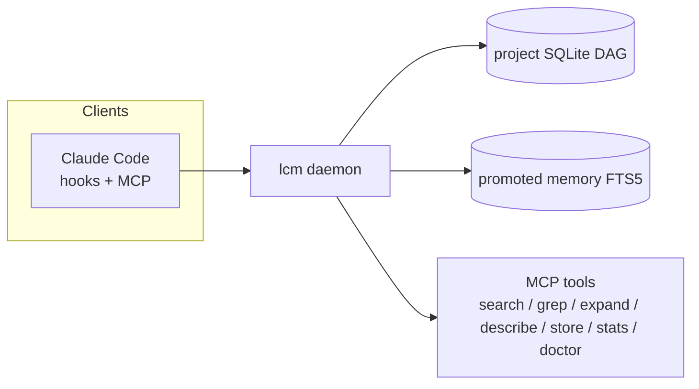
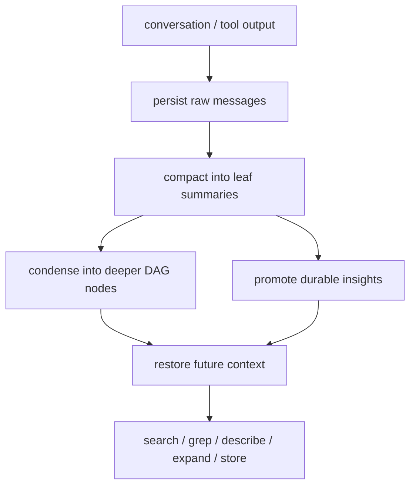
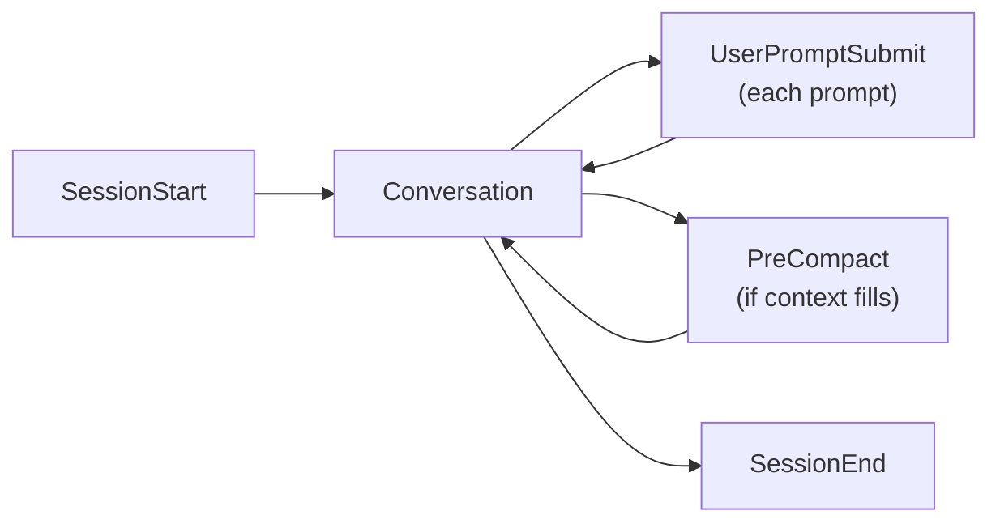

<p align="center">
  <strong>lcm</strong><br>
  Shared memory infrastructure for coding agents
</p>

<p align="center">
  DAG-based summarization, SQLite-backed message persistence, promoted long-term memory, MCP retrieval tools
</p>

<p align="center">
  <a href="https://www.npmjs.com/package/@lossless-claude/lcm"></a>
  <a href="LICENSE"></a>
  <a href="package.json"></a>
  <a href="https://github.com/anthropics/claude-code"></a>
</p>

<p align="center">
  <a href="https://lossless-claude.com">Website</a> &bull;
  <a href="#runtime-model">Runtime Model</a> &bull;
  <a href="#installation">Installation</a> &bull;
  <a href="#mcp-tools">MCP Tools</a> &bull;
  <a href="#development">Development</a>
</p>

---

`lcm` replaces sliding-window forgetfulness with a persistent memory runtime for both humans and agents.

- Every message is stored in a project SQLite database.
- Older context is compacted into a DAG of summaries instead of being dropped.
- Durable decisions and findings are promoted into cross-session memory.
- Claude Code already has end-to-end hook integration, while VS Code and Codex use connector-based workflows on the same backend today.

Humans and agents use the same backend. The integration surface differs by client, but the memory model is shared.

This repo started as a fork of [lossless-claw](https://github.com/Martian-Engineering/lossless-claude) by [Martian Engineering](https://martian.engineering), adapted for Claude Code. The LCM model and DAG architecture originate from the [Voltropy paper](https://papers.voltropy.com/LCM).

## Runtime Model


```mermaid
flowchart LR
  subgraph Clients["Clients"]
    CC["Claude Code<br/>hooks + MCP"]
  end

  CC --> D["lcm daemon"]

  D --> DB[("project SQLite DAG")]
  D --> PM[("promoted memory FTS5")]
  D --> TOOLS["MCP tools<br/>search / grep / expand / describe / store / stats / doctor"]
```

### Capabilities by integration path

| Path | Restore | Prompt hints | Turn writeback | Automatic compaction | Notes |
|---|---|---|---|---|---|
| Claude Code | Yes | Yes | Yes, via transcript/hooks | Yes | Primary hook-based integration |
| GitHub Copilot (VS Code) | No | Yes, via skill/rules | No | No | Repo-local skill can teach Copilot to call `lcm`, but there is no automatic restore or turn capture yet |
| Codex | Yes | Yes | Yes, via native lifecycle hooks | LCM memory compacts on `PreCompact`; native compaction continues | `lcm connectors install codex` installs the hooks; see [docs/vscode-codex.md](docs/vscode-codex.md). MCP config in `.codex/config.toml` is still manual |

## LCM Model

| Phase | What happens |
|---|---|
| Persist | Raw messages are stored in SQLite per conversation |
| Summarize | Older messages are grouped into leaf summaries |
| Condense | Summaries roll up into higher-level DAG nodes |
| Promote | Durable insights are copied into cross-session memory |
| Restore | New sessions recover context from summaries and promoted memory |
| Recall | Agents query, expand, and inspect memory on demand |

Nothing is dropped. Raw messages remain in the database. Summaries point back to their sources. Promoted memory remains searchable across sessions.


```mermaid
flowchart TD
  A["conversation / tool output"] --> B["persist raw messages"]
  B --> C["compact into leaf summaries"]
  C --> D["condense into deeper DAG nodes"]
  C --> E["promote durable insights"]
  D --> F["restore future context"]
  E --> F
  F --> G["search / grep / describe / expand / store"]
```

## Installation

### Prerequisites

- Node.js 22+
- Claude Code if you want hook-based automation
- GitHub Copilot in VS Code if you want VS Code integration
- Codex CLI if you want Codex connector installation, summarization, or transcript import

### Claude Code

Install the `lcm` binary first:

```bash
npm install -g @lossless-claude/lcm  # provides the `lcm` command
```

```bash
claude plugin marketplace add lossless-claude/lcm
claude plugin install lcm@lossless-claude
lcm install
```

`lcm install` writes config, registers hooks, installs slash commands, registers MCP, and verifies the daemon.

### VS Code (GitHub Copilot)

Install the `lcm` binary first:

```bash
npm install -g @lossless-claude/lcm
```

Then install the repo-local Copilot connector:

```bash
lcm connectors install github-copilot
lcm connectors doctor github-copilot
```

This creates a workspace skill under `.github/skills/lcm-memory/SKILL.md` so Copilot can search and store memory through the `lcm` CLI.

### Codex

Install the `lcm` binary first:

```bash
npm install -g @lossless-claude/lcm
```

Then install the Codex connector:

```bash
lcm connectors install codex
lcm connectors doctor codex
```

The default connector installs native hooks for automatic restore, prompt recall, incremental turn capture, and compaction continuity. Review and trust them in Codex `/hooks`; connector diagnostics distinguish configuration from activation. See [Codex setup](docs/vscode-codex.md).

Import older Codex sessions or replay both Claude and Codex history:

```bash
lcm import --codex
lcm import --replay
```

If you also want MCP inside Codex, run `lcm connectors install codex --type mcp`. Today that prints the TOML block you must add manually to `.codex/config.toml`.

See [`docs/vscode-codex.md`](docs/vscode-codex.md) for the current VS Code/Codex setup path and known shortcomings.

## Hooks

The plugin registers seven hooks. Every hook fails open (exit 0) and, before running, removes stale copies of itself left in `settings.json` by older installers so nothing fires twice.

| Hook | Command | Purpose |
|---|---|---|
| `PreCompact` | `lcm compact --hook` | Writes a DAG summary before compaction |
| `SessionStart` | `lcm restore` | Restores project context, recent summaries, and promoted memory |
| `SessionEnd` | `lcm session-end` | Ingests the completed Claude transcript |
| `UserPromptSubmit` | `lcm user-prompt` | Searches memory and injects prompt-time hints |
| `Stop` | `lcm session-snapshot` | Rolling transcript ingest, throttled |
| `PostToolUse` | `lcm post-tool` | Passive learning: records decisions, plans, files, commands |
| `PostToolUseFailure` | `lcm post-tool` | Passive learning: records tool errors |


```mermaid
flowchart LR
  SS["SessionStart"] --> CONV["Conversation"]
  CONV --> UP["UserPromptSubmit<br/>(each prompt)"]
  UP --> CONV
  CONV --> PC["PreCompact<br/>(if context fills)"]
  PC --> CONV
  CONV --> SE["SessionEnd"]
```

## MCP Tools

| Tool | Purpose |
|---|---|
| `lcm_search` | Search across episodic memory (messages and summaries) and promoted memory |
| `lcm_grep` | Regex or full-text search across raw messages and summaries |
| `lcm_expand` | Decompress a summary node into its source content by traversing the DAG |
| `lcm_describe` | Inspect metadata and lineage of a memory node (depth, token count, parent/child links) |
| `lcm_store` | Persist durable memory manually with optional tags |
| `lcm_stats` | Show token savings, compression ratios, and usage statistics |
| `lcm_doctor` | Diagnose daemon, hooks, MCP registration, and summarizer setup |

## CLI

```bash
# Setup & diagnostics
lcm install                # setup wizard
lcm uninstall              # remove hooks, MCP, and config
lcm doctor                 # diagnostics: daemon, hooks, MCP, summarizer
lcm diagnose               # scan recent sessions for hook failures
lcm status                 # daemon + summarizer mode
lcm -V                     # version

# Memory inspection
lcm search "query"        # search episodic and promoted memory
lcm grep "pattern"        # search messages and summaries
lcm describe <nodeId>      # inspect metadata for a memory node
lcm expand <nodeId>        # expand a summary node into source detail
lcm store "content"       # persist a durable memory entry
lcm stats                  # memory and compression overview
lcm stats -v               # per-conversation breakdown
lcm stats --pool           # connection pool statistics

# Compaction & promotion
lcm compact                # compact the current project
lcm compact --all          # compact all tracked projects
lcm compact --replay       # compact sequentially with threaded context (resumable)
lcm compact --replay --restart  # discard recorded progress and start from scratch
lcm promote                # promote durable insights to long-term memory
lcm promote --all          # promote across all tracked projects

# Import / export
lcm import                 # import Claude Code sessions for the current project
lcm import --all           # import all projects
lcm import --replay        # import and compact with threaded context (resumable)
lcm import --replay --restart # discard recorded progress and start from scratch
lcm import --provider codex   # import Codex sessions (--codex is the short form)
lcm export                 # export promoted knowledge to JSON on stdout
lcm export --all --output <f> # every project, written to files; --tags, --since filter
lcm import-knowledge <f>   # import a knowledge JSON file

# Connectors (wire lcm into other AI agents)
lcm connectors list        # list available agents and installed connectors
lcm connectors install <a> # install a connector for an agent (--type rules|mcp|skill|hooks)
lcm connectors remove <a>  # remove a connector for an agent
lcm connectors doctor      # check connector health
lcm connectors install <a> --global  # in the agent's user-level config, not this repo

# Sensitive data
lcm sensitive add <pat>    # add a redaction pattern (project-scoped)
lcm sensitive add --global # add a global redaction pattern
lcm sensitive list         # list all active patterns
lcm sensitive test <str>   # test what gets redacted
lcm sensitive purge --yes  # remove all stored data for the current project

# Daemon
lcm daemon start --detach  # start daemon in background
lcm daemon restart         # pick up changed LCM_* values
lcm daemon stop --hold     # keep it down so hooks cannot respawn it (--minutes <n>, --reason <text>)

# Hook handlers (internal — called by Claude Code and Codex hooks)
lcm compact --hook         # PreCompact hook (Claude Code)
lcm restore                # SessionStart hook (Claude Code)
lcm session-end            # SessionEnd hook (Claude Code)
lcm user-prompt            # UserPromptSubmit hook (Claude Code)
lcm post-tool              # PostToolUse + PostToolUseFailure hooks (Claude Code, passive learning)
lcm session-snapshot       # Stop hook (Claude Code, rolling ingest)
lcm codex-hook             # native Codex lifecycle hook — see docs/vscode-codex.md

# MCP server
lcm mcp                    # start MCP server
```

`lcm help [command]` prints this same reference from the CLI. `lcm bench` is a development-only
search benchmarking tool, not shipped to npm; see [docs/search.md](docs/search.md).

## Configuration

All environment variables are optional. The default summarizer mode is `auto`. The daemon reads the tuning values when it starts: after changing one, run `lcm daemon restart`.

| Variable | Default | Description |
|---|---|---|
| `LCM_SUMMARY_PROVIDER` | `auto` | `auto`, `claude-process`, `codex-process`, `copilot-process`, `anthropic`, `openai`, or `disabled` |
| `LCM_SUMMARY_API_KEY` | unset | Required by the `anthropic` provider |
| `LCM_HOME` | `~/.lossless-claude` | Where the daemon, databases, sidecars and logs live |
| `LCM_ENABLED` | `true` | Set to `false` to make every Claude Code and Codex command hook a no-op while keeping the plugin registered |
| `LCM_CONTEXT_THRESHOLD` | `0.75` | Context fill ratio that triggers compaction |
| `LCM_FRESH_TAIL_COUNT` | `8` | Most recent raw messages protected from compaction |
| `LCM_LEAF_MIN_FANOUT` | `3` | Minimum raw messages outside the fresh tail before a leaf pass runs |
| `LCM_CONDENSED_MIN_FANOUT` | `2` | Minimum same-depth summaries before they are condensed |
| `LCM_CONDENSED_MIN_FANOUT_HARD` | `1` | The same minimum during a hard-trigger sweep |
| `LCM_INCREMENTAL_MAX_DEPTH` | `0` | Condensation depth after each leaf pass; `-1` is unlimited |
| `LCM_LEAF_CHUNK_TOKENS` | `20000` | Maximum source tokens per leaf compaction pass |
| `LCM_CONDENSED_TARGET_TOKENS` | `900` | Target size for condensed summaries |

`auto` resolves per caller:

- `lcm` -> `claude-process`
- explicit config or `LCM_SUMMARY_PROVIDER` override always takes precedence

See [`docs/configuration.md`](docs/configuration.md) for tuning notes and deeper operational guidance.

## Development

```bash
npm install
npm run build
npx vitest
npx tsc --noEmit
```

To score a candidate summarizer model against the real compaction engine, see [docs/summarizer-bench.md](https://github.com/lossless-claude/lcm/blob/main/docs/summarizer-bench.md). The bench is opt-in — it is skipped unless `LCM_EVAL_MODEL` and `LCM_EVAL_CORPUS_DIR` are set, so `npx vitest` never calls a paid API.

### Repository layout

```text
bin/
  lcm.ts                      CLI entry point (binary: lcm)
src/
  compaction.ts               DAG compaction engine
  connectors/                 client integration adapters
  daemon/                     HTTP daemon, lifecycle, config, routes
  db/                         SQLite schema + promoted memory
  hooks/                      Claude hook handlers + auto-heal
  llm/                        summarizer backends
  mcp/                        MCP server + tool definitions
  store/                      conversation and summary persistence
installer/
  install.ts                  setup wizard
  uninstall.ts                cleanup
test/
  bench/                      summarizer eval bench (opt-in, see docs/summarizer-bench.md)
  ...                         Vitest suites
```

## Privacy

All conversation data is stored locally in `~/.lossless-claude/`. Nothing is sent to any lossless-claude server.

If you configure an external summarizer (`claude-process`, `anthropic`, `openai`, etc.), messages are sent to that provider for summarization — after built-in secret redaction. lcm scrubs common secret patterns (API keys, tokens, passwords) from message content before writing to SQLite and before sending to the summarizer.

Add project-specific patterns with `lcm sensitive add "MY_PATTERN"`. See [docs/privacy.md](docs/privacy.md) for full details.

## Technical Notes

- Claude Code integration is hook-first.
- The daemon is shared; the memory backend is client-agnostic.
- The repo carries the original lossless-claw lineage; the current runtime is Claude Code oriented.

## Acknowledgments

`lcm` stands on the shoulders of [lossless-claw](https://github.com/Martian-Engineering/lossless-claude), the original implementation by [Martian Engineering](https://martian.engineering). The DAG-based compaction architecture, the LCM memory model, and the foundational design decisions all originate there.

The underlying theory comes from the [LCM paper](https://papers.voltropy.com/LCM) by [Voltropy](https://x.com/Voltropy).

## License

MIT
