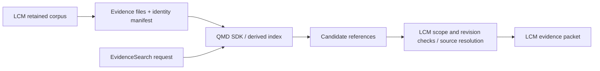

# QMD as an LCM retrieval Adapter

**Assessment:** 2026-09-07. Recommendation for a bounded experiment, not an approved dependency or measured quality result.

## Recommendation

Evaluate the public `@tobilu/qmd` SDK before implementing a separate hybrid-search stack. Keep LCM's EvidenceSearch Interface and canonical corpus. Put QMD behind an internal candidate-retrieval Seam, with its index treated as a replaceable projection.

This is stronger than “borrow a few ideas”: QMD already provides lexical/vector retrieval, query expansion, rank fusion, chunked reranking, model lifecycle and index maintenance. Rebuilding all of that needs a demonstrated reason. Its document-oriented corpus model does not, however, replace LCM's source provenance, summary ancestry, coverage or temporal semantics.

## Verified version and supported Interface

- Local checkout inspected: `e428df7`, package 2.6.3. It was clean; it was not updated or installed.
- Current upstream release and npm package verified independently: **2.8.3**, Node **>=22**, ESM root export and TypeScript declarations.
- QMD 2.0 explicitly declared a stable SDK as its primary Interface. Treat it as a supported library, not a CLI-only tool or a private import.
- The release's public SDK was checked separately from the older local implementation. Use public root exports and pin the experimental version/model fingerprints; do not copy assumptions from the old checkout into compatibility tests.

Sources: [2.8.3 release](https://github.com/tobi/qmd/releases/tag/v2.8.3), [versioned changelog](https://github.com/tobi/qmd/blob/v2.8.3/CHANGELOG.md), [package manifest](https://github.com/tobi/qmd/blob/v2.8.3/package.json), [public SDK](https://github.com/tobi/qmd/blob/v2.8.3/src/index.ts). The npm version was verified with `npm view`; no package installation ran.

## What to reuse, and what LCM still owns

| Responsibility | Proposed owner |
|---|---|
| BM25/vector candidate retrieval, expansion and rank fusion | QMD experiment |
| Chunk-aware reranking, local model loading, index/embedding maintenance | QMD experiment |
| Runtime ingestion, retained source text, capture exclusions and source revisions | LCM |
| Evidence identity, raw/source resolution, summary lineage and historical meaning | LCM |
| Coverage manifests, tombstones, final scope validation and generation receipts | LCM |
| Token-budgeted agent packet, episode diversity and hook emission policy | LCM |

The public SDK offers `createStore`, `search`, `searchLex`, `searchVector`, document retrieval, `update`, `embed` and health methods. Its unified search accepts structured queries and can disable reranking. The fast lexical operation avoids inference; turning off reranking alone is not equivalent to disabling expansion or embeddings. [SDK Interface](https://github.com/tobi/qmd/blob/v2.8.3/src/index.ts)

Ideas worth adapting even if the SDK experiment fails include typed lexical/semantic query lanes, retaining the original query during expansion, chunk selection before reranking, explain traces, and explicit model/index maintenance. QMD-specific rank bonuses, candidate caps and model defaults are policy choices to measure, not universal constants to copy.

## Integration shape

For the first experiment, materialize one evidence-sized document per retained passage or coherent turn range, not one multi-day session per file. The side manifest maps its path and content revision to LCM EvidenceRefs and source spans. Generated context must be distinguishable from retained text. Updates and deletes flow from the LCM change journal; no ad hoc export that quietly becomes stale.

Use a separate QMD index per project in the initial experiment. Keep its SQLite file separate from LCM's database. The documented ingestion Interface scans filesystem collections; no direct text-upsert operation appears in the checked public SDK. Do not bypass that Interface with writes to QMD's internal tables merely to avoid projection files.

QMD result IDs are not LCM's durable evidence identity. Resolve every returned candidate against the identity manifest and current LCM source eligibility before returning context. A stale QMD hit must not resurrect deleted content. If the same text occurs in multiple sessions, retain all source occurrences without inventing independent corroboration.

Time/session filtering and request deadlines are explicit integration tests: the checked SearchOptions does not expose LCM's full scope/time contract or an AbortSignal. Post-filtering a small candidate list can silently lose relevant evidence; the Adapter needs bounded refill or a supported constrained path, and must report incomplete retrieval when it cannot honor the request. Do not claim that the full EvidenceSearch contract is solved simply because SDK search returns results.

## Adoption costs

QMD adds `better-sqlite3`, `sqlite-vec`, `node-llama-cpp` and supporting packages alongside LCM's existing `node:sqlite`. Node-version compatibility is encouraging, but native installation, memory, concurrency and shutdown behavior still need an integration check. Own QMD's database/model lifecycle inside a dedicated worker if necessary; `Promise.race` alone cannot cancel blocking native work. [Manifest](https://github.com/tobi/qmd/blob/v2.8.3/package.json)

The documented default models total roughly 2 GB of downloads, with runtime memory in addition. They can run locally. Benchmark Portuguese/English and cross-language queries instead of treating defaults as already suitable for this corpus. Model files and fingerprints must be pinned separately from the npm package. [Official usage and model documentation](https://github.com/tobi/qmd/blob/v2.8.3/README.md)

QMD is MIT-licensed. If code is copied, preserve the applicable copyright and permission notice; model/dependency licenses remain separate. Using the SDK avoids maintaining a copied retrieval implementation. [License](https://github.com/tobi/qmd/blob/v2.8.3/LICENSE)

## Small experiment before a dependency decision

1. Use an isolated, reviewed Claude/Codex corpus snapshot and the same evidence units for both candidates. Keep private data local and do not trigger model downloads as a side effect of ordinary search.
2. Compare LCM lexical retrieval, QMD lexical retrieval, and QMD hybrid retrieval with reranking separately enabled. Record expansion/model configuration; use equal evidence/context budgets.
3. Test source-ID mapping, repeated text, parser revisions, deletion, project/session/time constraints, incomplete indexes and model failure. Include native-worker disposal and cold start.
4. Measure candidate and final-packet evidence quality, PT/EN slices, exact identifiers, warm/cold latency, memory, indexing cost and projection maintenance.
5. Adopt the SDK if quality and maintenance savings justify the projection/native costs while preserving the contract. Otherwise adapt only the small policies that proved useful; do not fork the entire tool by default.

This experiment should precede selecting a separate vector engine, model runner or custom reranking pipeline for LCM. No installation, corpus export, benchmark execution or source copying was performed in this assessment.
