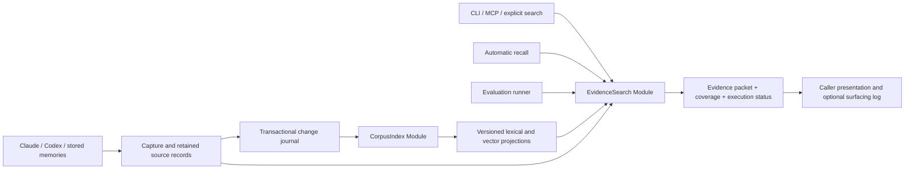

# Evidence search for LCM

**Status:** proposed design, 2026-09-07. No retrieval-quality claim or new dependency is approved by this document.

## Recommendation

Build one deep **EvidenceSearch Module** that returns attributable, budgeted evidence. Give CLI search, automatic recall and evaluation the same retrieval **Interface**. Keep source capture and index maintenance in a separate **CorpusIndex Module**. SQLite remains the local source of truth; lexical and semantic indexes are rebuildable projections.

Use passage retrieval, multilingual hybrid candidates, rank fusion, bounded reranking, and source-aware context packing. Start with lexical retrieval behind the new Interface, then admit each additional technique through measured ablations. The target is excellent agent-memory retrieval, not a large collection of interchangeable infrastructure.

**Provisional operating assumption:** corpus and indexes stay local; separately configured inference may run on an owned endpoint or an external provider. This proposal does not authorize exporting existing conversations, downloading models, running a full replay, or replacing storage.

## The problem this design must solve

The September 7 audit found three distinct problems:

- Coverage: the measured database contained only Claude sessions. Codex discovery/import was repaired, but the 1,412 discovered Codex sessions have not yet been replayed into that corpus.
- Ranking: preserving relevance instead of re-sorting by insertion date improved the old diagnostic from 2/20 to 7/20. Its questions and single-session labels remain unsuitable for a representative quality gate.
- Divergent semantics: explicit search, prompt recall and the benchmark construct different result sets. Five returned snippets can represent only one or two sessions.

The database snapshot inspected for this design contains 296 conversations, 28,132 messages, 589 summaries and approximately 9.0 million estimated message tokens. Passage count, not session count, will determine vector memory and query cost. These are local observations, not public benchmark results.

Current implementation anchors:

| Location | Behavior relevant to the design |
|---|---|
| [search route](../../src/daemon/routes/search.ts) | Constructs stores, retrieves messages/summaries, concatenates them, then limits results. |
| [prompt-search route](../../src/daemon/routes/prompt-search.ts) | Searches promoted memories only; owns recency, feedback, cooldown and context packing. |
| [retrieval](../../src/retrieval.ts) | Provides grep, describe and summary expansion; preserves within-source relevance after the recent fix. |
| [conversation store](../../src/store/conversation-store.ts), [summary store](../../src/store/summary-store.ts) | Duplicate FTS preparation, filtering and fallback policies. |
| [benchmark](../../src/bench.ts) | Independently builds a session ranking; its single-source hit metric is not full evidence recall. |
| [query preparation](../../src/store/fts5-query.ts) | English stopwords and AND→OR fallback; no semantic understanding. |
| [import](../../src/import.ts), [Codex parser](../../src/codex-transcript.ts) | Coverage depends on explicit runtime selection and retained event types. |

## Three Interface designs considered

| Design | Depth and Leverage | Locality and cost | Decision |
|---|---|---|---|
| A. `search` + `resolve` over attributable evidence | Callers express a query, scope and budget; ranking, provenance and packing stay hidden. | One location for retrieval policy. Automatic hints still need a separate presentation policy. | **Use as the external Seam.** |
| B. Declarative evidence plan with multiple dependent needs | Strong for comparisons and jointly required evidence across sessions. | Caller must understand a plan language, dependencies and partial execution. Too much hypothetical Interface today. | Keep bounded query decomposition internal; expose no public DSL yet. |
| C. One `recall` operation returning episode packets | Very convenient for an agent continuing work. | Grouping can bury exact facts or add unrelated context; exhaustive inspection is awkward. | Adopt its packet presentation inside A, anchored in passages rather than summaries alone. |

The recommendation combines A's small Interface with C's useful output. It does not combine all three public Interfaces. B only earns an external Seam if multiple real callers later require coordinated evidence plans.

## Module placement



**Deletion test:** removing EvidenceSearch would force candidate fusion, provenance resolution, deduplication, expansion and budget packing back into several callers. That is the complexity the Module must actually absorb. A wrapper around today's concatenated store results would not earn its place.

## External Interface

Illustrative TypeScript defines the intended contract, not a new exported library yet:

```ts
type SearchRequest = {
  query: string;
  scope: {
    projectId: string;
    sessionIds?: string[]; // a hard filter
    sourceTime?: { since?: string; before?: string }; // [since, before)
  };
  context?: {
    currentSessionId?: string; // a hint, never a session filter
    omitRefs?: EvidenceRef[]; // presentation exclusions applied before packing
  };
  match?: "natural" | "literal";
  budget?: { maxContextTokens: number; deadlineMs: number };
};

type EvidenceRef = string; // opaque, versioned and project-scoped
type EvidenceItem = {
  ref: EvidenceRef;
  kind: "message" | "memory" | "summary";
  text: string; // an exact retained-text span, not a rewritten quotation
  origin: "claude" | "codex" | "manual" | "unknown";
  sessionId: string | null;
  groupId: string; // correlated evidence, not independent corroboration
  sourceTime: string | null;
  sourceRefs: EvidenceRef[];
  sourceResolution: "resolved" | "not-applicable" | "unavailable";
};

type SearchResult = {
  evidence: EvidenceItem[];
  context: string; // the rendered, citation-bearing agent packet
  receipt: {
    corpusRevision: string;
    indexGeneration: string;
    policyRevision: string;
    tokenizerRevision: string;
    coverage: "known" | "partial" | "unknown";
    coverageRef: string;
    elapsedMs: number;
    contextTokens: number;
    execution: "complete" | "partial";
    limitations: string[]; // stable machine codes, not only prose
  };
};

interface EvidenceSearch {
  search(request: SearchRequest): Promise<SearchResult>;
  resolve(request: {
    scope: SearchRequest["scope"];
    refs: EvidenceRef[];
    maxContextTokens: number;
  }): Promise<SearchResult>;
}
```

The ordinary call supplies only project and query. Propose a 2,000-token/500-ms default budget for initial testing; defaults are versioned construction-time policy and measured before release. Hooks supply their smaller budget. Callers do not select vector dimensions, fusion constants, chunking algorithms or candidate counts. `resolve` inspects known evidence under the same scope without asking search to rediscover it.

### Invariants callers and tests share

1. **Scope first.** Apply project/session/time restrictions to every candidate path and to resolution. There is no silent global fallback. A cross-project reference does not disclose content or its existence.
2. **Stable attribution.** A reference identifies retained source revision and span, not a transient vector row or mutable summary text. Compaction does not change its meaning. Deletion returns unavailable; it never resolves to replacement text.
3. **Honest provenance.** A stored memory is evidence of that recorded assertion. A generated summary is labeled as such. Existing records with unknown authorship or unresolved ancestry remain explicitly unknown; do not invent source links or silently discard all legacy notes.
4. **Time semantics.** `sourceTime` means original conversation observation time, not import time and not inferred real-world event time. Unknown times stay unknown. Natural-language guesses do not become hard date filters without an explicit request. A time filter is not an historical snapshot of the index.
5. **Literal semantics.** Literal matching performs contiguous text matching on retained source text, case-sensitive and without semantic expansion. Natural matching retains identifier candidates while adding other retrieval paths. Literal results can be packed/truncated, but each excerpt remains an exact span.
6. **Order and diversity.** Results are useful-evidence order, with deterministic source-position ties for a fixed execution. Multiple necessary passages from one episode are allowed; repetition is not independent support. Grouping never merges source identity.
7. **Budget.** `maxContextTokens` covers the returned `context`, including citations and limitation notices, under a recorded tokenizer version. Structured diagnostics are not silently charged as agent context. Callers inject `context`, not both it and the duplicated structured evidence. An insufficient minimum budget is a typed request error.
8. **Deadline.** The deadline is a bounded-work budget, not hard real-time execution. Optional stages stop when time is exhausted; non-preemptible SQLite work must be bounded and measured. Slow work belongs off the daemon's request event loop. Model cancellation and timeout cannot change scope or source records.
9. **Absence is conditional.** Empty evidence means no returned match under the recorded scope, capabilities and budget. It is not proof that a fact never existed. Execution completeness and corpus coverage are different fields.
10. **Reads do not train themselves.** Searching or benchmarking does not increment usage or surfacing counters. Actual hint emission records an explicit, idempotent event outside this read Interface.

Invalid requests and inaccessible/corrupt authoritative storage are typed errors. A missing optional encoder, incomplete vector generation or reranker timeout returns lexical evidence with explicit limitations. Query-time execution never initiates a full reindex, model download or model-provider migration.

## Canonical evidence and coverage

Retain immutable, policy-scrubbed source text and its capture provenance. Do not describe a parsed corpus as lossless relative to events it intentionally omitted: the current Codex importer retains user/assistant response text, not all tool events. Capture manifests state those exclusions. References must remain usable after external transcript files rotate; do not make evidence resolution depend solely on a temporary JSONL path.

Use small relational records, extending existing storage rather than replacing it:

| Record | Required meaning |
|---|---|
| Source revision | Project, runtime, session/root lineage when known, parser and retention-policy version, source locator, content digest, original and ingestion times. |
| Evidence unit | Stable source-revision span; message/memory/summary kind; role; ancestry; text; identifiers. |
| Derived representation | Unit revision plus chunker/context/encoder fingerprint; never an authoritative fact. |
| Change journal | Durable additions, corrections and deletions committed with source changes. |
| Index generation | Projection version, journal watermark, model fingerprint, build status and publication time. |
| Coverage manifest | Discovery snapshot and counts at discovered→parsed→retained→indexed stages, with units and explicit exclusions/errors. |

Coverage is scoped and revisioned. Unknown discovery is not zero missing sessions. Root/agent lineage and duplicate exports must be recorded where available; unknown lineage remains unknown. The receipt includes compact coverage status; `coverageRef` names a durable local manifest receipt. The existing diagnostics surface must gain a manifest reader in increment 1, with the same project access checks. It is not an evidence reference accepted by `resolve`. Do not require a second lookup merely to discover that coverage is incomplete.

## Retrieval Implementation

### 1. Evidence-sized indexing

Use message/turn structure to form passages. Preserve short commands and identifiers; split oversized tool/text blocks only under a declared capture policy. Keep offsets into the retained text, surrounding-turn links and summary ancestry. A starting chunk-size experiment may compare 256/512/768-token spans; none is a universal setting.

Do not embed whole multi-day sessions as the only searchable objects. Summaries and optional chunk-specific context may improve discovery, but their generated text stays separate from original evidence. Compare contextual indexing against plain passages before paying its indexing cost. [Anthropic's contextual-retrieval experiments](https://www.anthropic.com/engineering/contextual-retrieval) motivate this experiment, not a promised LCM improvement.

### 2. Complementary candidate paths

- **Literal/identifier path:** exact commands, paths, issue IDs, hashes and quoted spans. Normalize aliases separately from retained display text. Never let semantic rewriting remove the original query.
- **Lexical path:** a unified projection over eligible evidence kinds with FTS5 BM25. Test Portuguese, English, accents and code tokenization. English Porter stemming is not a multilingual strategy; FTS5 also offers Unicode and trigram facilities. [SQLite FTS5](https://www.sqlite.org/fts5.html)
- **Semantic path:** a multilingual encoder over the same eligible evidence identities. Apply scope before candidate admission; if an eventual ANN implementation filters after retrieval, it must refill under a bounded policy and report unresolved filtering loss.

Lexical search must work offline without any model. Dense retrieval runs independently rather than only after lexical search returns zero: nonempty lexical results can still be wrong. Model IDs, dimensions, normalization, instructions and preprocessing form one fingerprint; query and document encodings must match it.

### 3. Fusion, then selective reranking

Deduplicate by evidence identity within each candidate lane, including expanded-query variants. Fuse independent ranked lists rather than adding incomparable raw BM25 and vector scores. Begin with RRF; its constants and lane weights are measured policy, not public knobs or facts about correctness. [Original RRF work](https://research.google/pubs/reciprocal-rank-fusion-outperforms-condorcet-and-individual-rank-learning-methods/)

Measure candidate recall before reranking. A reranker cannot recover absent evidence. Apply it only to a bounded shortlist when the remaining deadline permits; compare it with fusion alone at equal output budgets. Qwen3 Embedding/Reranker and BGE-M3 are credible multilingual candidates to evaluate, not selected packages or guaranteed winners. Start with one dense representation; learned sparse and multivector retrieval require incremental evidence to justify their cost. [Qwen3](https://arxiv.org/abs/2506.05176), [BGE-M3](https://arxiv.org/abs/2402.03216)

### 4. Expansion and packet construction

Retrieve specific passages first, then expand adjacent turns and existing summary ancestry when useful. Deduplicate literal copies and lineage overlap; avoid counting a summary and its original as two confirmations. Pack complementary evidence under the token budget, keeping citations with each excerpt. Preserve conflicting/revised observations for historical questions.

Do not equate relevance scores with factual confidence. Do not apply blanket recency decay to explicit historical search. Hook-specific cooldown decides which known references to pass as `context.omitRefs`; EvidenceSearch applies those explicit presentation exclusions before packing, with observable dropped-item reasons. Hooks may emit or drop the complete packet, but never remove individual excerpts from an already packed packet and rebuild citations or budgets themselves. Promotion may be a measured candidate prior, not the only searchable corpus.

### 5. Bounded investigation, later

For demonstrated multi-step misses, experiment with a small internal evidence plan: preserve the original query, add bounded subqueries, follow known links, then deduplicate and repack. Log every expansion and its cost. No always-on autonomous search loop.

Use the existing message-order and summary DAG before extracting a new entity graph. GraphRAG's foundational evidence primarily concerns global thematic synthesis; it does not justify a graph database for exact historical recall. [GraphRAG](https://arxiv.org/abs/2404.16130)

## Index lifecycle and operations

CorpusIndex owns incremental projection, recovery and publication. Source writes append to a transactional journal; the indexer advances an idempotent watermark only after durable projection work. Repeated events cannot create duplicate units. Corrections and deletions remove stale lexical/vector candidates as well as cached packets.

Readers use one coherent generation. A replacement encoder or chunker builds a shadow generation, verifies counts and sample resolution, then atomically publishes. Do not mix embedding dimensions/models across generations. If new source text is ahead of the active projection, return a visible lag receipt; an optional bounded lexical delta path must identify its own watermark. Never label an index current because its worker process is alive.

Retain the previous compatible generation for rollback. Cache keys include scope, query, presentation exclusions and corpus/index/policy/model/tokenizer revisions. At materialization and cache return, recheck authoritative tombstones and source-revision eligibility: stale or rolled-back indexes must never resurrect deleted content. Removed items require Module-owned repacking. Index cleanup is eventual; serving deleted data is not. Corrections must distinguish a superseded retained observation from an invalid source revision, preserving explicitly requested historical evidence without serving invalid parser output as current evidence. Inference failures do not roll back captured source records. Model calls occur outside SQLite write transactions.

Start with SQLite plus an exact vector-search experiment. Benchmark projected passage counts, vector bytes, filtered recall, write latency and memory before adopting ANN or a separate vector database. A package decision requires a measured need and a compatible Node/macOS deployment path. No new dependency is selected here.

## Dependency strategy and testing Seam

| Dependency category | Design |
|---|---|
| In-process | Normalization, fusion, diversification, packing and validation are pure Implementation functions. No Adapter for every stage. |
| Local-substitutable | Use real temporary SQLite at the Module's Interface in tests. No generic repository abstraction solely to mock SQL. |
| Remote but owned | Configured inference endpoint behind an internal Interface; production and deterministic test Adapters. |
| True external | Explicitly configured provider Adapter with cancellation, error translation and usage accounting. |

The composition root may construct concrete SQLite and model Adapters. Callers receive EvidenceSearch; they do not construct stores or orchestrate ranking. Introduce a Seam where behavior actually varies, not wherever a scanner flags a constructor.

Behavior tests cross the same Interface as callers: exact source fidelity, scope, temporal filtering, literal/PT/EN queries, duplicate lineage, budget packing, missing sources, index lag, deletion, retries and model timeout. Replace redundant tests of retired orchestration after the new behavior tests cover it. Keep algorithm-specific tests only where they enforce an independent invariant.

## Evaluation that can support a quality claim

Freeze a corpus/discovery/index snapshot before comparing policies. Claude and Codex coverage must be independently reconciled. Separate capture failure, indexing failure, candidate-retrieval failure, ranking/packing failure and downstream reading failure.

Build an initial independently judged set of real information needs, split by underlying episode/root-session lineage into development, validation and an untouched final test. Tune repeated ablations on development/validation only. Once final-test failures have been inspected for design changes, that set is no longer untouched; collect or rotate a fresh final test before another certification claim. Aim for at least 200 cases as a practical pilot, not a statistical guarantee; increase judgments until uncertainty is useful. Include:

- identifier/path/error lookup and literal requests;
- anchored natural language, Portuguese, English and cross-language queries;
- decisions and rationale, reversals, historical state and temporal constraints;
- troubleshooting procedures, environment gotchas and workflow knowledge;
- multi-session questions with jointly required evidence;
- false premises, ambiguous requests and genuinely unsupported questions.

Each case records an expected answer or abstention, graded relevance, exact supporting spans, acceptable alternative sources and jointly required evidence sets. A prompt that asks for work does not prove the work happened. Pool lexical, dense and literal candidates for blinded judging; distinguish unjudged from irrelevant. Do not generate the holdout from the same summaries used for indexing.

Measure the shared Module's final packet, with stage diagnostics for attribution:

| Measurement | Purpose |
|---|---|
| Candidate evidence recall at a fixed cap | Detect retrieval omissions before reranking. |
| nDCG and first-useful-evidence rank | Judge graded ranking quality. |
| Required-evidence coverage in the final packet | Detect incomplete multi-source answers and packing loss. |
| Citation support and downstream answer/abstention accuracy | Test whether useful context actually enables correct answers. |
| Duplicate tokens and evidence tokens | Measure context efficiency. |
| Warm/cold p50/p95, memory, indexing throughput, model usage | Measure operational cost and latency. |

Publish per-runtime/language/query-class slices and paired uncertainty. Compare against exact/literal and FTS baselines on the same retained corpus and token budget. Report raw-JSONL grep as a separate experiment. The old 20-question score and the synthetic fixture score remain diagnostics; do not rename their hit rate as evidence recall. [Ranked-retrieval evaluation](https://nlp.stanford.edu/IR-book/html/htmledition/evaluation-of-ranked-retrieval-results-1.html)

LongMemEval informs temporal, update, multi-session and abstention cases. The newer LongMemEval-V2 adds agent workflow/gotcha/state/premise cases; it is a work-in-progress web-agent evaluation, so adopt useful categories rather than transferring headline results to LCM. [LongMemEval](https://arxiv.org/abs/2410.10813), [LongMemEval-V2](https://arxiv.org/abs/2605.12493)

**Promotion rule:** development/validation selects the candidate; the untouched final test checks the preregistered metric against the same-corpus baseline, with paired uncertainty and no material regression in critical exact/scope/negative cases. Source fidelity, deletion, scope and budget invariants are hard gates. An unjudged or undersampled run does not certify quality. Start with the existing 500-ms warm lexical p95 goal; benchmark semantic/reranked latency on target hardware before selecting its default budget. A slower investigative policy must be explicit, not silently replace the fast path.

## Trunk-based delivery

Each increment is independently usable, with a short commit series on main and no big-bang storage rewrite:

| Increment | Delivered behavior | Exit evidence |
|---|---|---|
| 1. Coverage and identity | Versioned source refs, source-time/lineage gaps made explicit, runtime manifests and judged pilot set. | Reconcile discovery→retention→index counts; resolve sampled Claude/Codex/legacy-memory refs. |
| 2. Shared lexical Module | Explicit search and benchmark call one Interface; filters, source ordering, diversity and packet budgets move inside it. | Real SQLite contract tests; parity receipts and intentional-difference tests; remove caller-owned merging. |
| 3. Automatic recall integration | Same EvidenceSearch, explicit smaller budget and separate emission/cooldown policy. | Replay representative prompts; compare utility and unwanted hints; preserve promoted-memory behavior intentionally. |
| 4. Semantic candidates | One versioned multilingual encoder, shadow vectors and RRF, lexical degradation path. | Same-corpus held-out ablation, rebuild/crash/deletion tests, measured memory and latency. |
| 5. Reranking and context | Bounded reranker and optional contextual indexing/expansion. | Candidate recall already adequate; equal-budget packet/answer gains justify cost. |
| 6. Targeted advanced retrieval | Bounded multi-query/temporal or graph experiments for specific failures. | A named failure class improves; remove experiments that do not earn their complexity. |

Do not broaden capture, change the encoder, alter chunking and replace ranking in one experiment. Roll back policy/projection generations independently of captured source data. Existing grep/describe/expand compatibility remains until callers migrate; regex inspection need not inherit semantic-search behavior.

## Static findings and design scope

The automated grade card reports 209 major findings, with no blocker. It is a heuristic inventory, not 209 verified defects. The supplied report lists examples and aggregated remainder counts, so the unlisted findings cannot be individually adjudicated from it.

Relevant findings are addressed structurally here: route-owned ranking/budgeting moves into a deep Module; repeated search filters become the request scope; failures become explicit results; store-specific orchestration leaves callers. Concrete construction at the composition root is intentional. Local array/Map accumulation inside discovery is not an externally visible query side effect. Splitting every function at 20 lines or adding an Adapter around every constructor would increase the Interface without demonstrating Depth.

No repository-wide cleanup is bundled into this design. Validate remaining scanner findings against source when their code enters an implementation increment; do not claim this proposal has fixed them.

## Decisions still requiring evidence

The proposed Module shape and lifecycle are concrete enough for the first two increments. Encoder/reranker choice, vector engine, passage sizes, candidate counts, semantic default latency, contextual indexing, and advanced graph retrieval remain experiments. The operating assumption about remote inference remains provisional. A state-of-the-art claim requires a representative measured result; an architecture diagram cannot supply it.

**QMD follow-up:** the supported `@tobilu/qmd` SDK is now the first integration candidate to evaluate before rebuilding the hybrid pipeline. Keep the EvidenceSearch Interface and LCM source ownership; test QMD as an internal Adapter with a derived evidence projection. See the [versioned assessment and experiment](./qmd-assessment.md). This changes the implementation investigation order, not the dependency approval status.
